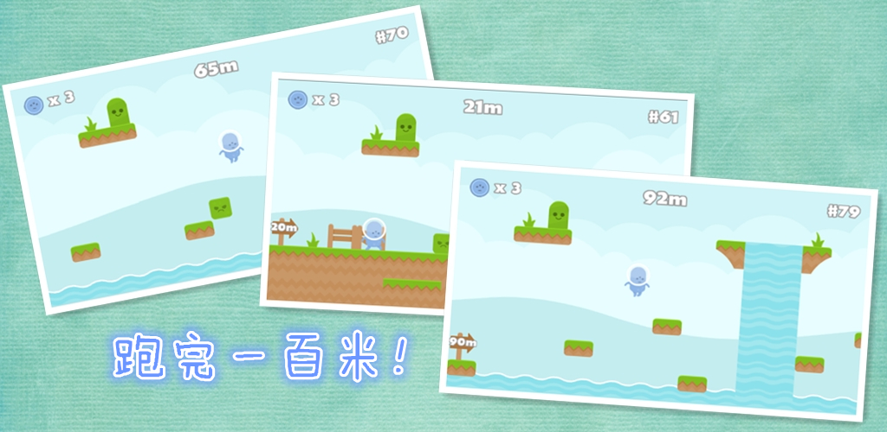

# 用Phaser和PhoneGap来开发iOS和Android游戏 #

这是一个教大家用Phaser和PhoneGap来开发iOS和Android手机游戏的教程

两个月前看到[Phaser](http://phaser.io)这个很简洁漂亮的HTML5 Javascript游戏框架后便有了在业余时间做一个手游玩玩的念头。一个月前也开始陆陆续续的照着[Phaser官网的教程](http://phaser.io/tutorials/making-your-first-phaser-game)学习Phaser。

为什么要写下面一系列的教程呢？主要是为了治愈目前的拖延，督促自己完成目标。而且：从头到尾设计一个游戏，进行编码并最终在AppStore上线是一件很好玩的事情。不是嚒？“从AppStore下载自己写的游戏来玩”，想想就觉得很酷 :-)

当然，如果你能从中受益，开发出属于你自己的游戏，那就更好了！

下面的教程将一步一步的教你如何设计、开发和发布用Phaser开发的游戏。（教程在不断更新中）

## 《跑完一百米》Android和iOS版游戏已经发布，敬请下载试玩
* Android
	* [Google Play](https://play.google.com/store/apps/details?id=com.easy.meterrace "Google Play")
	* [豌豆荚](http://www.wandoujia.com/apps/com.easy.meterrace "豌豆荚")
* iOS
	* [AppStore](https://itunes.apple.com/us/developer/zhu-zhong/id1035152444 "AppStore")
	
## 教程 ##

1. [为什么写这篇博客](http://zhongzhu.github.io/2016/03/11/%E7%94%A8Phaser%E5%92%8CPhoneGap%E6%9D%A5%E5%BC%80%E5%8F%91iOS%E5%92%8CAndroid%E6%B8%B8%E6%88%8F-1-%E4%B8%BA%E4%BB%80%E4%B9%88%E5%86%99%E8%BF%99%E7%AF%87%E5%8D%9A%E5%AE%A2/)
2. [游戏策划](http://zhongzhu.github.io/2016/03/15/%E7%94%A8Phaser%E5%92%8CPhoneGap%E6%9D%A5%E5%BC%80%E5%8F%91iOS%E5%92%8CAndroid%E6%B8%B8%E6%88%8F-2-%E6%B8%B8%E6%88%8F%E7%AD%96%E5%88%92/)
3. [用Tiled-Map-Editor来生成游戏场景](http://zhongzhu.github.io/2016/03/25/%E7%94%A8Phaser%E5%92%8CPhoneGap%E6%9D%A5%E5%BC%80%E5%8F%91iOS%E5%92%8CAndroid%E6%B8%B8%E6%88%8F-3-%E7%94%A8Tiled-Map-Editor%E6%9D%A5%E7%94%9F%E6%88%90%E6%B8%B8%E6%88%8F%E5%9C%BA%E6%99%AF/)
4. [Phaser基础知识](http://zhongzhu.github.io/2016/03/28/%E7%94%A8Phaser%E5%92%8CPhoneGap%E6%9D%A5%E5%BC%80%E5%8F%91iOS%E5%92%8CAndroid%E6%B8%B8%E6%88%8F-4-Phaser%E5%9F%BA%E7%A1%80%E7%9F%A5%E8%AF%86/)
5. [显示游戏场景](http://zhongzhu.github.io/2016/04/10/%E7%94%A8Phaser%E5%92%8CPhoneGap%E6%9D%A5%E5%BC%80%E5%8F%91iOS%E5%92%8CAndroid%E6%B8%B8%E6%88%8F-5-%E6%98%BE%E7%A4%BA%E6%B8%B8%E6%88%8F%E5%9C%BA%E6%99%AF/)
6. [让Player动起来](http://zhongzhu.github.io/2016/05/09/%E7%94%A8Phaser%E5%92%8CPhoneGap%E6%9D%A5%E5%BC%80%E5%8F%91iOS%E5%92%8CAndroid%E6%B8%B8%E6%88%8F-6-%E8%AE%A9Player%E5%8A%A8%E8%B5%B7%E6%9D%A5/)
7. [游戏的状态及Player胜利失败条件](http://zhongzhu.github.io/2016/05/27/%E7%94%A8Phaser%E5%92%8CPhoneGap%E6%9D%A5%E5%BC%80%E5%8F%91iOS%E5%92%8CAndroid%E6%B8%B8%E6%88%8F-7-%E6%B8%B8%E6%88%8F%E7%9A%84%E7%8A%B6%E6%80%81%E5%8F%8APlayer%E8%83%9C%E5%88%A9%E5%A4%B1%E8%B4%A5%E6%9D%A1%E4%BB%B6/) 
8. ToDo

## 有用的知识 ##
1. [压缩游戏里的PNG图片](http://zhongzhu.github.io/2016/04/05/%E5%8E%8B%E7%BC%A9%E6%B8%B8%E6%88%8F%E9%87%8C%E7%9A%84PNG%E5%9B%BE%E7%89%87/)
- ToDo
